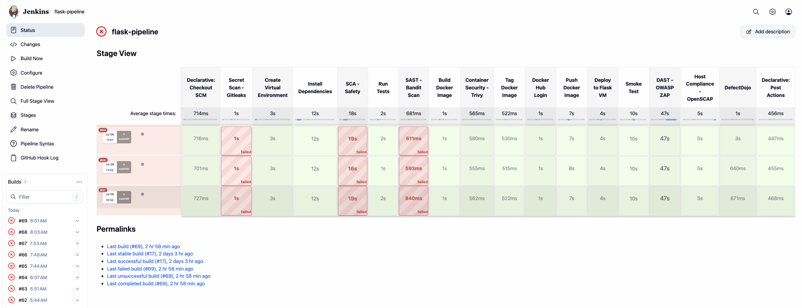
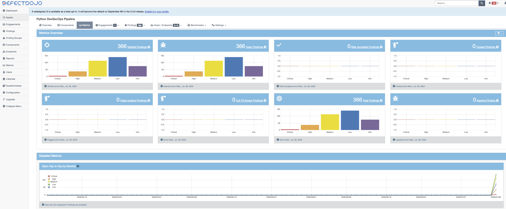
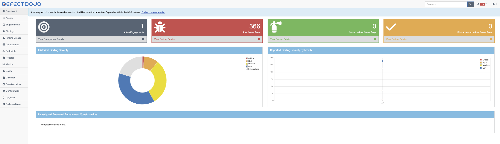
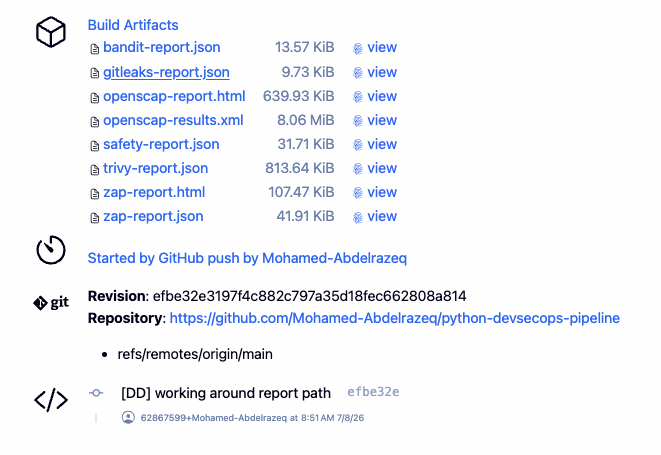
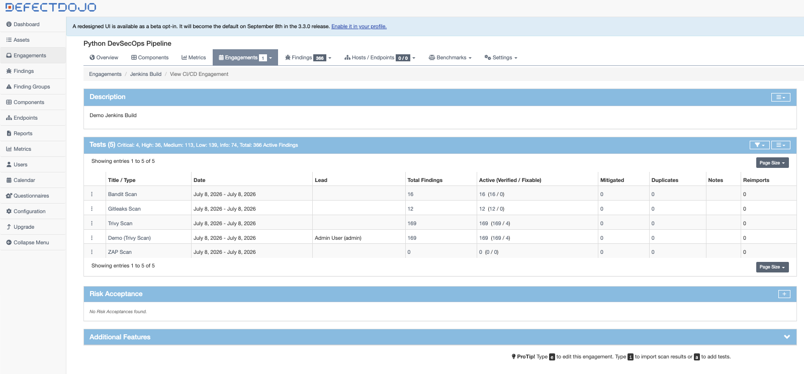
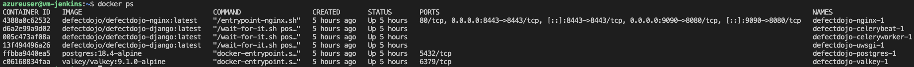
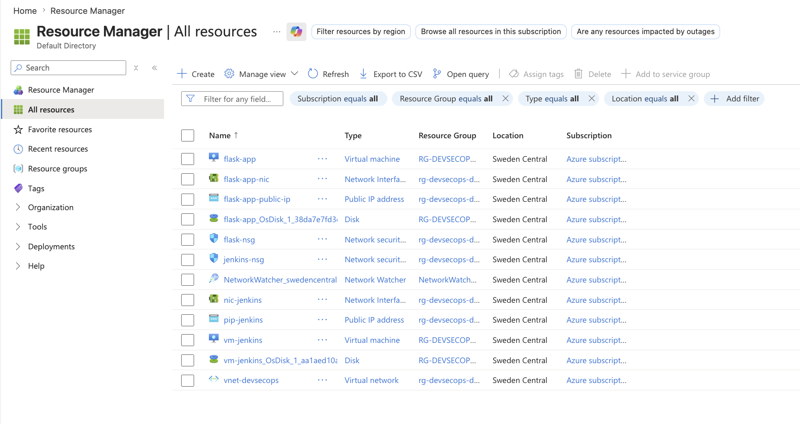
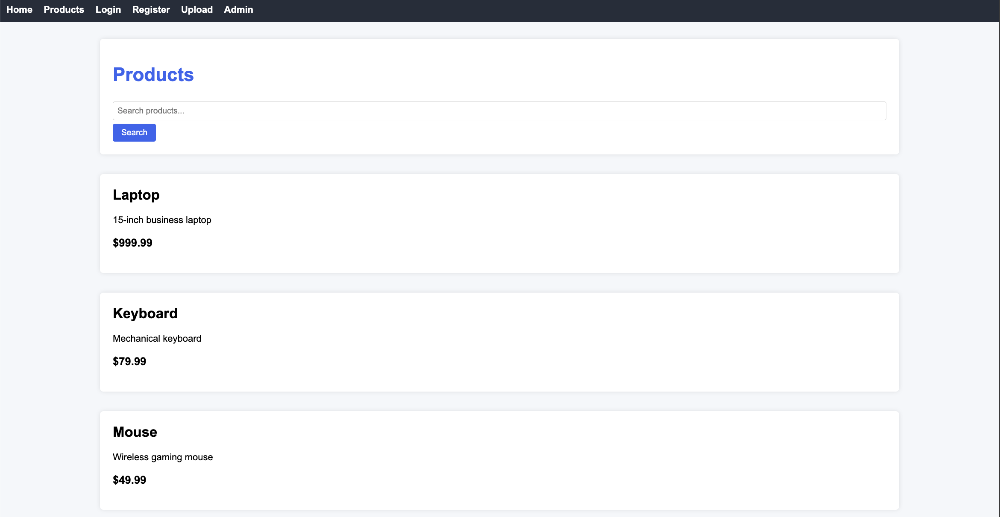

# 🛡️ Secure DevSecOps CI/CD Pipeline

A production-inspired **DevSecOps CI/CD pipeline** built on **Microsoft Azure**, automating the secure delivery of a Python Flask application using **Terraform**, **Ansible**, **Jenkins**, **Docker**, and multiple security scanning tools.

The project demonstrates how Infrastructure as Code (IaC), Configuration Management, Continuous Integration, Continuous Deployment, and Continuous Security can be combined into a fully automated pipeline. Every code change is automatically validated, scanned, containerized, deployed, and its security findings are centralized in **DefectDojo**.

---

# Project Objectives

- Design and implement a secure, end-to-end **DevSecOps CI/CD pipeline** following **Shift-Left Security** principles.
- Provision secure and reproducible cloud infrastructure on **Microsoft Azure** using **Terraform** (Infrastructure as Code).
- Automate secure server configuration and application provisioning with **Ansible**, ensuring consistent and hardened environments.
- Build a fully automated **Jenkins** pipeline to orchestrate build, test, security scanning, containerization, and deployment stages.
- Integrate multiple security controls into the CI/CD workflow, including **SAST**, **SCA**, **Secrets Detection**, **Container Image Scanning**, and **DAST**.
- Deploy the application as a **Docker** container while validating container images for known vulnerabilities.
- Aggregate and manage security findings in **DefectDojo** to provide centralized vulnerability tracking, deduplication, and reporting.
- Demonstrate how Infrastructure as Code, Configuration Management, CI/CD automation, and continuous security testing work together to build a practical, production-inspired **DevSecOps** pipeline on Azure.

---

# Technologies Used

| Category | Technologies |
|----------|--------------|
| Cloud | Microsoft Azure |
| Infrastructure as Code | Terraform |
| Configuration Management | Ansible |
| CI/CD | Jenkins |
| Application | Python, Flask |
| Containerization | Docker, Docker Compose |
| Secrets Scanning | Gitleaks |
| Dependency Scanning | Safety |
| Static Analysis | Bandit |
| Container Security | Trivy |
| Dynamic Security Testing | OWASP ZAP |
| Compliance | OpenSCAP |
| Vulnerability Management | DefectDojo |

---

# High-Level Architecture

```text
                    Developer
                        │
                        │ Push Code
                        ▼
               GitHub Repository
                        │
                        ▼
               Jenkins CI/CD Server
             (Public IP + Private IP)
                        │
      ┌─────────────────┼─────────────────┐
      │                 │                 │
      ▼                 ▼                 ▼
 Build & Test     Security Scans     Docker Image
      │                 │                 │
      └─────────────────┼─────────────────┘
                        │
                        ▼
               DefectDojo Upload
          (Centralized Findings)
                        │
                        ▼
              Docker Image Deployment
                        │
                        ▼
                Flask Application VM
                  (Private Network)
```

---

# Azure Infrastructure

The environment consists of two Ubuntu virtual machines deployed inside the same Azure Virtual Network.

- **Jenkins VM**
  - Hosts Jenkins
  - Runs the CI/CD pipeline
  - Executes all security tools
  - Builds Docker images
  - Pushes reports to DefectDojo

- **Flask VM**
  - Hosts the production Flask application
  - Receives Docker deployments from Jenkins
  - Is **not** directly accessible from the Internet

The two machines communicate over Azure's **private network**, while administrative access is performed securely through SSH.

```text
                    Internet
                        │
            ┌───────────┴───────────┐
            │                       │
         SSH (22)              Jenkins UI
            │                    (8080)
            ▼                       │
     ┌─────────────────────────────────────────┐
     │          Azure Virtual Network          │
     │                                         │
     │   Jenkins VM                Flask VM    │
     │  Public + Private IP      Private IP    │
     │         │                     │         │
     │         └──── Private Network ──────────┘
     │
     │ Jenkins deploys Docker containers
     │ directly to the Flask VM using
     │ its private IP over SSH.
     └─────────────────────────────────────────┘
```

---

# Repository Structure

```text
python-devsecops-pipeline/
├── Dockerfile
├── Jenkinsfile
├── README.md
├── ansible
│   ├── ansible.cfg
│   ├── flash-app.yml
│   ├── hosts.ini
│   └── jenkins.yml
├── app
|   |
│   ├── app.py
│   ├── backup_credentials.txt
│   ├── config.py
│   ├── database.py
│   ├── dev_notes.md
│   ├── init_db.py
│   ├── models.py
│   ├── requirements.txt
│   ├── static/
│   ├── templates/
│   ├── tests/
│   └── uploads
│       ├── Application Security.pdf
│       └── requirements.txt
├── docker-entrypoint.sh
├── sast
├── secret-scanning
│   └── gitleaks.toml
├── terraform
    ├── flask-app.tf
    ├── jenkins.tf
    ├── locals.tf
    ├── network.tf
    ├── outputs.tf
    ├── provider.tf
    ├── security.tf
    └── variables.tf
```

---

# Infrastructure Provisioning

Infrastructure provisioning is fully automated using **Terraform**.

Terraform is responsible for creating the Azure environment, including:

- Resource Group
- Virtual Network
- Subnet
- Network Security Groups
- Public IP Address (Jenkins VM)
- Network Interfaces
- Jenkins Virtual Machine
- Flask Virtual Machine

This approach provides repeatable deployments and allows the complete environment to be recreated from source-controlled infrastructure definitions.

---

# Server Configuration

After infrastructure provisioning, **Ansible** configures both virtual machines automatically.

The playbook installs and configures all required software without manual intervention.

## Jenkins Server

Ansible installs and configures:

- Docker CE
- Docker Compose Plugin (Compose V2)
- Jenkins
- Java 21
- Git
- Python 3
- Gitleaks
- Trivy

It also:

- Enables required services
- Adds Jenkins to the Docker group
- Configures package repositories
- Starts Jenkins automatically

## DefectDojo

The playbook also deploys DefectDojo by:

- Cloning the official repository
- Starting the application with Docker Compose
- Exposing the web interface on port **9090**

```bash
git clone https://github.com/DefectDojo/django-DefectDojo
cd django-DefectDojo
DD_PORT=9090 docker compose up -d
```

The deployment is fully automated through Ansible, requiring no manual configuration after execution.

---

# Why Terraform + Ansible?

The project separates infrastructure provisioning from server configuration.

| Terraform | Ansible |
|-----------|----------|
| Creates Azure resources | Configures operating systems |
| Provisions networking | Installs software |
| Creates virtual machines | Configures Jenkins |
| Manages infrastructure lifecycle | Deploys DefectDojo |
| Infrastructure as Code | Configuration as Code |

This separation follows common DevOps practices, making the environment modular, reproducible, and easier to maintain.

---

# CI/CD Pipeline

The Jenkins pipeline automates the complete software delivery lifecycle, from source code checkout to deployment and security reporting.

Every pipeline execution follows the same sequence to ensure code quality, application security, and deployment consistency.

```text
                 GitHub Push
                      │
                      ▼
               Jenkins Pipeline
                      │
      ┌───────────────┴───────────────┐
      ▼                               ▼
 Checkout Source              Install Dependencies
      │                               │
      └───────────────┬───────────────┘
                      ▼
                Static Analysis
              (Bandit + Gitleaks)
                      │
                      ▼
              Dependency Scanning
                   (Safety)
                      │
                      ▼
              Docker Image Build
                      │
                      ▼
            Container Security Scan
                (Trivy Image)
                      │
                      ▼
           Infrastructure Compliance
                  (OpenSCAP)
                      │
                      ▼
           Dynamic Security Testing
                  (OWASP ZAP)
                      │
                      ▼
          Upload Results to DefectDojo
                      │
                      ▼
          Deploy to Flask Application VM
```

---

# Pipeline Stages

## 1. Source Code Checkout

Jenkins clones the latest version of the project directly from GitHub.

This guarantees every pipeline execution is performed against the most recent source code.

---

## 2. Python Environment Setup

A dedicated Python virtual environment is created before installing project dependencies.

This keeps the Jenkins environment isolated and reproducible across builds.

Tasks include:

- Create Python virtual environment
- Install project dependencies
- Upgrade pip
- Prepare runtime environment

---

## 3. Static Application Security Testing (SAST)

### Bandit

Bandit performs static analysis of the Python source code.

It identifies common security issues such as:

- Hardcoded credentials
- Unsafe subprocess execution
- Weak cryptography
- Command injection risks
- Insecure deserialization

Output:

```
bandit-report.json
```

---

### Gitleaks

Gitleaks scans the repository for accidentally committed secrets.

Examples include:

- API keys
- Passwords
- Tokens
- SSH Keys
- Cloud credentials

Output:

```
gitleaks-report.json
```

---

## 4. SCA

### Safety

Safety scans installed Python packages against known CVEs.

It helps detect vulnerable third-party libraries before deployment.

Output:

```
safety-report.json
```

---

## 5. Docker Build

The application is packaged into a Docker image.

Each build is tagged using both:

- Jenkins Build Number
- latest

Example:

```
python-devsecops-pipeline:62
python-devsecops-pipeline:latest
```

This guarantees reproducible deployments while keeping a rolling latest image available.

---

## 6. Container Security

### Trivy

Trivy scans the generated Docker image for vulnerabilities.

The scan covers:

- Operating System packages
- Installed libraries
- Language-specific dependencies
- Known CVEs

Output:

```
trivy-report.json
```

---

## 7. Infrastructure Compliance

### OpenSCAP

OpenSCAP evaluates the target system against security compliance benchmarks.

The scan verifies:

- Operating system configuration
- Security policies
- Hardening recommendations

Outputs:

```
openscap-results.xml
openscap-report.html
```

---

## 8. Dynamic Application Security Testing (DAST)

### OWASP ZAP

Once the application is deployed, ZAP performs an automated security assessment.

The scan checks for common web vulnerabilities including:

- Missing security headers
- Information disclosure
- Injection points
- Authentication weaknesses
- Configuration issues

Outputs:

```
zap-report.html
zap-report.json
```

---

# Security Reports

At the end of the pipeline, Jenkins generates multiple reports.

| Tool             | Report                      |
|------------------|-----------------------------|
| Bandit           | bandit-report.json          |
| Gitleaks         | gitleaks-report.json        |
| Safety           | safety-report.json          |
| Trivy            | trivy-report.json           |
| OpenSCAP         | openscap-results.xml        |
| OWASP ZAP        | zap-report.json             |

These reports are archived as Jenkins build artifacts and can be downloaded for further analysis.

---

# DefectDojo Integration

Instead of relying on Jenkins plugins, the pipeline uploads scan results directly to the DefectDojo REST API.

This approach provides:

- Version independence
- Easier maintenance
- Better portability
- Native support for multiple scanners

Each supported report is imported into the same engagement, allowing DefectDojo to centralize findings from multiple security tools.

```text
        Security Reports
               │
               ▼
         Jenkins Pipeline
               │
               ▼
        DefectDojo REST API
               │
               ▼
      Unified Vulnerability Dashboard
```

The upload process is authenticated using a DefectDojo API Token stored securely in Jenkins Credentials.

---

# Deployment

Once all pipeline stages complete successfully, Jenkins deploys the latest Docker image to the Flask virtual machine.

Deployment is performed over SSH using the Flask VM's private IP inside the Azure Virtual Network.

The deployment process includes:

- Pull latest Docker image
- Stop existing container
- Start updated container
- Verify application availability

This keeps deployments isolated from the public Internet while maintaining automated delivery.

---

# Installation

## Clone the repository

```bash
git clone https://github.com/Mohamed-Abdelrazeq/python-devsecops-pipeline.git
cd python-devsecops-pipeline
```

---

## Provision Azure Infrastructure

```bash
cd terraform

terraform init
terraform plan
terraform apply
```

---

## Configure the Virtual Machines

```bash
cd ansible

ansible-playbook -i inventory jenkins.yml
```

---

## Access Jenkins

```
http://<jenkins-public-ip>:8080
```

---

## Access DefectDojo

```
http://<jenkins-public-ip>:9090
```

---

## Trigger the Pipeline

1. Commit changes
2. Push to GitHub
3. Jenkins automatically executes the pipeline
4. Review archived security reports
5. Review findings in DefectDojo

---

# Project Highlights

- Infrastructure fully provisioned using Terraform
- Server configuration automated with Ansible
- Secure Docker-based application deployment
- Integrated SAST, SCA, Container, Compliance, and DAST scanning
- Centralized vulnerability management using DefectDojo
- Reproducible and automated DevSecOps workflow
- Production-inspired Azure architecture

---

# 📸 Screenshots

## 🚀 Jenkins Pipeline

<p align="center">
  
</p>

---

## 📊 DefectDojo Dashboard & Metrics

<p align="center">
  
  
</p>

---

## 🛡️ Security Reports

<p align="center">
  
  
</p>

---

## 🐳 Docker

<p align="center">
  
</p>

---

## ☸️ Azure Resource Manager

<p align="center">
  
</p>

---

## 🌐 Running Application

<p align="center">
  
</p>


---

# Author

**Mohamed Abdelrazek**

- GitHub: https://github.com/Mohamed-Abdelrazeq
- LinkedIn: https://www.linkedin.com/in/mohamed-abdelrazek-9621811a7/

---

# License

This project is licensed under the MIT License.